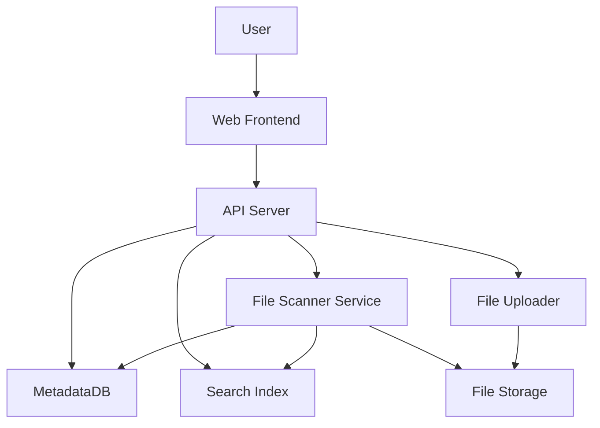
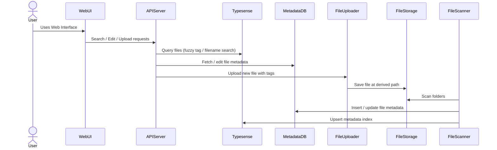

Scientific File Tagging and Retrieval System

# Background

A scientific team has accumulated a large collection of data files (e.g., CSV, PDFs, Word documents, and images) over the years. These files are dispersed across various folders and servers and lack a consistent organization scheme. The lack of semantic structure and duplication in naming and storage has led to inefficiencies in accessing relevant data for analysis or reference.

Currently, file access is done through a remote Windows Explorer interface, making it cumbersome and inefficient to search and locate needed information.

The proposed solution is a web-based application that will automatically scan file directories, assign semantic tags to files using rule-based methods (e.g., folder structure, naming conventions), and register them in a central database. This system will also support querying, editing, and uploading files in an organized manner based on metadata tags, improving accessibility and workflow efficiency. Future versions may include AI-based enhancements for more intelligent tagging and content understanding.

# Requirements

The system must address the following requirements based on the MoSCoW prioritization model:

## Must Have

- Automatically scan specified folders at configurable intervals
- Extract metadata and assign tags to files based on directory structure and naming conventions
- Store file metadata, tags, and paths in a centralized database
- Provide a responsive web interface for:
  - Filtering and querying files based on tags
  - Displaying file metadata and providing access paths
  - Editing, adding, or removing file tags
- Rules for tagging files defined by the user

## Should Have

- Authentication and basic access control to protect tagging and upload operations
- Efficient performance for large volumes of files (tens of TBs)
- Basic monitoring/logging of scan and upload activity

## Could Have

- Bulk tag editing or tag templates
- Role-based permission levels
- Plugin-based rule system to extend tagging logic
- Preview or visualization of complex files (e.g., CSV plotting, image viewers)
- Allow uploading files with manual tag input and intelligent path placement based on tags
- Text based search (for text containing files such as `.docx`, `.pdf`)

## Won't Have (for MVP)

- AI/ML-based tag inference
- Real-time collaboration features


# Method

## Architecture Overview



## Database Schema (PostgreSQL)


| Field | Description | Type |
| ----- | ----------- | ---- |
| id | Unique identifier | UUID |
| filename | Name of the file | TEXT |
| path | Full absolute file path | TEXT |
| directory | Containing folder | TEXT |
| file_type | mime-type or extension (e.g., `image/png`, `csv`) | TEXT |
| tags | JSON array of tags | JSONB |
| created_at | Original file creation date | TIMESTAMP |
| updated_at | Last modified date on disk | TIMESTAMP |
| deleted_at | Null unless deleted | TIMESTAMP (nullable) |
| last_indexed_at | Last time it was scanned/indexed | TIMESTAMP |


## Typesense Schema (Fuzzy Search)

```json
{
  "name": "files",
  "fields": [
    { "name": "filename", "type": "string" },
    { "name": "tags", "type": "string[]", "facet": true },
    { "name": "path", "type": "string" },
    { "name": "directory", "type": "string" },
    { "name": "file_type", "type": "string", "facet": true },
    { "name": "updated_at", "type": "int64" },
    { "name": "created_at", "type": "int64" }
  ],
  "default_sorting_field": "updated_at"
}
```

## File Scanner Logic

1. Scheduled scanning of configured root directories
2. For each file, extract metadata and infer tags based on path/naming
3. Upsert metadata into PostgreSQL
4. Index metadata into Typesense
5. Track soft deletions based on scan diffs

## Component Flow



## Tradeoffs

- **PostgreSQL + Typesense** combo ensures structured queries + fast fuzzy search
- Avoids content parsing (for now) to keep MVP fast
- Decoupled services for flexibility and independent scaling
- Docker Compose over Kubernetes to simplify initial deployment
- Directory-based rules offer fast results but limited semantic understanding

## Implementation

## Stack

- Backend: FastAPI or Express.js
- Frontend: React (Vite or Next.js)
- Search: Typesense
- DB: PostgreSQL
- Scanner: Python
- Infrastructure: Docker Compose

## Steps

1. Define DB schema and Typesense schema
2. Build API endpoints (search, edit, upload)
3. Implement scanner to run on schedule and sync metadata
4. Build frontend with tag filters, edit UI, upload form
5. Write docker-compose file linking services
6. Test local flow with sample dataset
7. Optional: add basic auth layer

## Milestones

1. **Project Initialization**

   - Create Git repo and basic folder structure
   - Set up Docker Compose file with service containers

2. **Metadata Schema Implementation**

   - PostgreSQL setup and table creation
   - Typesense schema definition

3. **File Scanner MVP**

   - Build a containerized Python service
   - Implement rule-based scanning, metadata extraction
   - Sync with DB and Typesense

4. **Backend API MVP**

   - Search API via Typesense
   - Metadata CRUD via PostgreSQL
   - File upload handler with tagging

5. **Frontend MVP**

   - Search interface with filters
   - Tag editing UI
   - File upload form

6. **End-to-End Integration**

   - Compose setup with shared volumes
   - Scanner auto-start and periodic scheduling
   - Test user journey: search → edit → upload

7. **Stabilization**

   - Add logging and error handling
   - Optional: Basic auth for edit/upload

## Gathering Results

Post-deployment, success will be evaluated based on:

- Reduction in time to find files via tag-based queries
- Accuracy of automated tags from rule engine
- Usability of tag editing and upload workflows
- System reliability (scanner coverage, no data loss)
- Feedback from users regarding efficiency improvements
