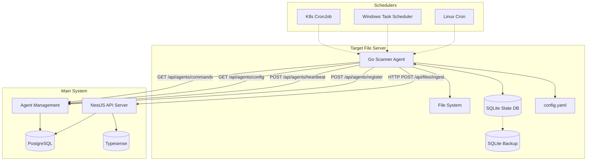

# High-Level Design: Go File Scanner Agent

## Executive Summary

This document outlines the design for a Go-based file scanning agent that will be deployed on target file servers to efficiently scan file systems and synchronize metadata with the Scientific File Tagging and Retrieval System. The agent is designed to be fast, minimal, portable, and compatible with legacy systems including Windows Server 2008.

## Table of Contents

1. [Requirements](#requirements)
2. [Architecture Overview](#architecture-overview)
3. [Design Decisions & Tradeoffs](#design-decisions--tradeoffs)
4. [Component Design](#component-design)
5. [Integration Strategy](#integration-strategy)
6. [Implementation Plan](#implementation-plan)
7. [Milestones & Tasks](#milestones--tasks)
8. [MVP vs Future Features](#mvp-vs-future-features)
9. [Risk Assessment & Mitigation](#risk-assessment--mitigation)
10. [Performance Targets](#performance-targets)
11. [Security Considerations](#security-considerations)
12. [Deployment Strategies](#deployment-strategies)
13. [Configuration Reference](#configuration-reference)
14. [Monitoring & Observability](#monitoring--observability)
15. [Future Enhancements](#future-enhancements)

## Requirements

### Functional Requirements

**Must Have (MVP):**

- Scan specified file system paths for file metadata
- Extract basic file information (filename, path, size, modification time, MIME type)
- Implement incremental scanning to detect file changes
- Batch HTTP requests to the main API server
- Support configuration via YAML files with server-side config updates
- Run as scheduled task (cron, Task Scheduler, K8s CronJob)
- Maintain local state using SQLite for change detection and scan resumption
- Handle network failures with exponential backoff retry logic
- Support API key authentication via environment variables
- Agent registration and heartbeat with server
- On-demand scan triggering from server
- File deletion detection and reporting
- Atomic file-level processing with batch commits to SQLite

**Should Have (MVP):**

- Cross-platform compatibility (Linux, Windows, macOS)
- Configurable batch sizes and scan intervals
- Comprehensive logging and error reporting
- Graceful handling of permission errors
- Support for ignore patterns (glob-based)
- SQLite backup and recovery mechanisms
- Exponential backoff for failed API calls
- Circuit breaker pattern for API failures

**Could Have (Future):**

- HTTP endpoint for on-demand scanning
- Real-time file system watching
- Metrics and monitoring endpoints
- Configuration hot-reloading
- Content-based file hashing for duplicate detection
- Plugin system for custom file processors

### Non-Functional Requirements

**Performance:**

- Handle tens of thousands of files efficiently
- Minimal memory footprint (<100MB typical usage)
- Fast startup time (<5 seconds)
- Concurrent file processing with worker pools (10-20 workers)
- Support up to 1M files per scan path
- Streaming file processing (no full dataset in memory)

**Reliability:**

- Survive network outages with offline operation capability
- Handle file system permission errors gracefully
- Maintain scan state across restarts with resume capability
- Idempotent operations with the main server
- SQLite corruption recovery with backup mechanisms
- Circuit breaker pattern for API failures

**Portability:**

- Single binary deployment
- Compatible with Go 1.17+ (Windows Server 2008 constraint)
- No external runtime dependencies
- Cross-compilation support

## Architecture Overview



### Data Flow

1. **Agent Registration**: Agent registers with server on startup
2. **Config Sync**: Agent pulls latest configuration from server
3. **Scheduler triggers** the Go agent or on-demand command received
4. **Incremental scan**: Agent scans configured paths, comparing with SQLite state
5. **Change detection**: Files are processed based on modification time + size
6. **Batch processing**: Changed files are batched for API submission
7. **HTTP requests**: Batched requests sent to main API server with retry logic
8. **State update**: SQLite updated atomically after successful server sync
9. **Heartbeat**: Regular status updates sent to server
10. **Backup**: Periodic SQLite backup for recovery

## Design Decisions & Tradeoffs

### Technology Choices

| Decision               | Rationale                                                                                             | Tradeoffs                                                      |
| ---------------------- | ----------------------------------------------------------------------------------------------------- | -------------------------------------------------------------- |
| **Go Language**        | Fast native code, excellent concurrency, single binary deployment, Windows Server 2008 compatibility  | Learning curve for team, different from existing Node.js stack |
| **SQLite for State**   | Embedded, no external dependencies, ACID transactions, excellent Go support, WAL mode for performance | Single-threaded writes (not an issue for this use case)        |
| **HTTP REST API**      | Simple, leverages existing `/files/ingest` endpoint, stateless                                        | Less efficient than message queues, but simpler                |
| **YAML Configuration** | Human-readable, supports comments, good Go libraries                                                  | Slightly more complex parsing than JSON                        |
| **Batch Processing**   | Reduces network overhead, leverages server idempotency                                                | Potential for larger memory usage, delayed updates             |

### File Change Detection Strategy

| Approach                   | Pros                                      | Cons                      | Decision           |
| -------------------------- | ----------------------------------------- | ------------------------- | ------------------ |
| **Mod Time + Size Only**   | Fast, minimal I/O, works for 95% of cases | Misses rare edge cases    | ✅ **MVP Choice**  |
| **Content Hash (SHA-256)** | 100% accurate, detects all changes        | High I/O cost, slow scans | Future enhancement |
| **Hybrid Approach**        | Fast + configurable accuracy              | Complex logic             | Future enhancement |

**MVP Decision**: Use modification time + file size for change detection to optimize for speed and simplicity.

### Architectural Tradeoffs

**Agent Responsibilities vs Server Responsibilities:**

- ✅ **Agent**: File I/O, metadata extraction, change detection, HTTP communication, local state management
- ✅ **Server**: Business logic, tagging rules, database operations, search indexing, agent management
- **Benefit**: Clean separation of concerns, agent stays minimal and fast

**Local State vs Stateless:**

- ✅ **Chose Local State (SQLite)**: Enables efficient incremental scanning and resume capability
- **Alternative**: Stateless with server-side change detection
- **Benefit**: Reduced network traffic, faster scans, works offline, resume interrupted scans

**Direct HTTP vs Message Queue:**

- ✅ **Chose Direct HTTP**: Simpler for MVP, leverages existing API
- **Alternative**: Message queue (Redis, RabbitMQ)
- **Benefit**: Fewer moving parts, easier deployment and debugging

**Server Config vs Local Config:**

- ✅ **Chose Server Config with Local Fallback**: Centralized management with offline capability
- **Alternative**: Local config only
- **Benefit**: Dynamic configuration updates, reduced operational overhead

## Component Design

### Project Structure (Nx Workspace)

```
apps/
├── scanner/                    # Go Scanner Agent
│   ├── cmd/
│   │   └── main.go            # Application entry point
│   ├── internal/
│   │   ├── agent/             # Core agent logic
│   │   │   ├── scanner.go     # File scanning engine
│   │   │   ├── state.go       # SQLite state management
│   │   │   └── config.go      # Configuration management
│   │   ├── api/               # HTTP API client
│   │   │   ├── client.go      # API client with retry logic
│   │   │   └── models.go      # Request/response models
│   │   ├── storage/           # SQLite operations
│   │   │   ├── schema.go      # Database schema
│   │   │   ├── migrations.go  # Schema migrations
│   │   │   └── backup.go      # Backup/recovery logic
│   │   └── utils/             # Utility functions
│   │       ├── filesystem.go  # File system operations
│   │       └── retry.go       # Retry and circuit breaker
│   ├── go.mod
│   ├── go.sum
│   └── project.json           # Nx project configuration
├── client/                     # Existing React app
└── server/                     # Existing NestJS app
```

### Core Components

#### 1. Scanner Engine (`internal/agent/scanner.go`)

```go
type Scanner struct {
    config     *Config
    state      *StateManager
    apiClient  *APIClient
    workerPool chan struct{} // Semaphore for concurrent workers
}

// Core scanning logic with resumption support
func (s *Scanner) ScanPaths(ctx context.Context, paths []string) error
func (s *Scanner) processFile(ctx context.Context, filePath string) (*FileMetadata, error)
func (s *Scanner) detectChanges(file *FileMetadata) (bool, error)
```

#### 2. State Manager (`internal/agent/state.go`)

```go
type StateManager struct {
    db *sql.DB
}

// SQLite operations for change detection and resumption
func (sm *StateManager) GetFileState(path string) (*FileState, error)
func (sm *StateManager) UpdateFileState(file *FileMetadata) error
func (sm *StateManager) CreateScanSession(paths []string) (*ScanSession, error)
func (sm *StateManager) ResumeScanSession(sessionID string) (*ScanSession, error)
```

#### 3. API Client (`internal/api/client.go`)

```go
type APIClient struct {
    baseURL    string
    apiKey     string
    httpClient *http.Client
    circuitBreaker *CircuitBreaker
}

// HTTP operations with retry logic and circuit breaker
func (c *APIClient) IngestFiles(ctx context.Context, files []FileMetadata) error
func (c *APIClient) RegisterAgent(ctx context.Context, agent *AgentInfo) error
func (c *APIClient) SendHeartbeat(ctx context.Context, status *AgentStatus) error
func (c *APIClient) GetConfig(ctx context.Context) (*Config, error)
func (c *APIClient) GetCommands(ctx context.Context) ([]Command, error)
```

### SQLite Schema Design

```sql
-- Scan sessions for resumability
CREATE TABLE scan_sessions (
    id TEXT PRIMARY KEY,
    started_at TIMESTAMP NOT NULL,
    completed_at TIMESTAMP,
    status TEXT NOT NULL, -- 'running', 'completed', 'failed', 'interrupted'
    scan_paths TEXT NOT NULL, -- JSON array of paths
    total_files INTEGER DEFAULT 0,
    processed_files INTEGER DEFAULT 0,
    failed_files INTEGER DEFAULT 0
);

-- File state for change detection
CREATE TABLE file_states (
    path TEXT PRIMARY KEY,
    mod_time TIMESTAMP NOT NULL,
    size INTEGER NOT NULL,
    hash TEXT, -- Optional for future enhancement
    last_scanned_at TIMESTAMP NOT NULL,
    sync_status TEXT NOT NULL, -- 'pending', 'synced', 'failed'
    retry_count INTEGER DEFAULT 0,
    last_error TEXT
);

-- Agent configuration cache
CREATE TABLE config_cache (
    key TEXT PRIMARY KEY,
    value TEXT NOT NULL,
    updated_at TIMESTAMP NOT NULL
);

-- Scan history (retained for 30 days)
CREATE TABLE scan_history (
    id TEXT PRIMARY KEY,
    session_id TEXT NOT NULL,
    file_path TEXT NOT NULL,
    action TEXT NOT NULL, -- 'created', 'updated', 'deleted', 'skipped'
    timestamp TIMESTAMP NOT NULL,
    error_message TEXT,
    FOREIGN KEY (session_id) REFERENCES scan_sessions(id)
);

-- Indexes for performance
CREATE INDEX idx_file_states_sync_status ON file_states(sync_status);
CREATE INDEX idx_file_states_last_scanned ON file_states(last_scanned_at);
CREATE INDEX idx_scan_history_session ON scan_history(session_id);
CREATE INDEX idx_scan_history_timestamp ON scan_history(timestamp);
```

### Backup and Recovery Strategy

**SQLite Backup Mechanism:**

- **Automatic backups**: Every 24 hours and before major operations
- **Backup retention**: 7 days of backups
- **Backup location**: `{data_dir}/backups/scanner_state_{timestamp}.db`
- **Recovery**: Automatic corruption detection with fallback to latest backup
- **Disaster recovery**: If all backups fail, rebuild from scratch with full scan

```go
type BackupManager struct {
    dbPath     string
    backupDir  string
    maxBackups int
}

func (bm *BackupManager) CreateBackup() error
func (bm *BackupManager) RestoreFromBackup(backupPath string) error
func (bm *BackupManager) CleanupOldBackups() error
```

## Integration Strategy

### Server-Side Requirements

**New API Endpoints Required:**

1. **Agent Management Endpoints:**

```typescript
// Agent registration
POST /api/agents/register
{
  agentId: string,
  hostname: string,
  version: string,
  scanPaths: string[],
  capabilities: string[]
}

// Heartbeat
POST /api/agents/heartbeat/{agentId}
{
  status: 'healthy' | 'degraded' | 'error',
  lastScanTime: string,
  filesProcessed: number,
  errorCount: number,
  memoryUsage: number
}

// Get agent configuration
GET /api/agents/{agentId}/config
Response: {
  scanPaths: string[],
  ignorePatterns: string[],
  scanInterval: string,
  batchSize: number
}

// Get commands for agent
GET /api/agents/{agentId}/commands
Response: {
  commands: [{
    id: string,
    type: 'scan' | 'stop' | 'restart',
    parameters: object,
    priority: 'low' | 'normal' | 'high'
  }]
}
```

2. **Enhanced File Ingestion:**

```typescript
// Add file size to existing endpoint
POST /api/files/ingest
{
  files: [{
    filename: string,
    fileType: string,
    path: string,
    size: number,        // NEW FIELD - requires migration
    lastIndexedAt?: string,
    tags?: string[]
  }]
}
```

**Database Schema Updates:**

```sql
-- Add file size column to existing files table
ALTER TABLE files ADD COLUMN file_size BIGINT;

-- Create agent management tables
CREATE TABLE agents (
  id UUID PRIMARY KEY DEFAULT gen_random_uuid(),
  agent_id VARCHAR(255) UNIQUE NOT NULL,
  hostname VARCHAR(255) NOT NULL,
  version VARCHAR(50) NOT NULL,
  status VARCHAR(50) NOT NULL,
  last_heartbeat TIMESTAMP WITH TIME ZONE,
  created_at TIMESTAMP WITH TIME ZONE NOT NULL,
  updated_at TIMESTAMP WITH TIME ZONE NOT NULL
);

CREATE TABLE agent_scan_paths (
  agent_id UUID REFERENCES agents(id),
  path_glob TEXT NOT NULL,
  PRIMARY KEY (agent_id, path_glob)
);

CREATE TABLE agent_commands (
  id UUID PRIMARY KEY DEFAULT gen_random_uuid(),
  agent_id UUID REFERENCES agents(id),
  command_type VARCHAR(50) NOT NULL,
  parameters JSONB,
  status VARCHAR(50) NOT NULL,
  created_at TIMESTAMP WITH TIME ZONE NOT NULL,
  executed_at TIMESTAMP WITH TIME ZONE
);
```

### Error Handling and Retry Strategy

**API Retry Logic:**

- **Exponential backoff**: 1s, 2s, 4s, 8s, 16s, 32s, max 5 minutes
- **Max retries**: 6 attempts over ~1 hour total
- **Circuit breaker**: Stop after 50% failure rate over 10 requests
- **Cool-down period**: 2 minutes before resuming after circuit break

**Batch Error Handling:**

- **Partial failures**: Retry only failed files from batch
- **Validation errors**: Log error, mark file as failed, continue processing
- **Network errors**: Retry entire batch with exponential backoff
- **Server errors (5xx)**: Retry with backoff, circuit breaker applies

**SQLite Error Recovery:**

- **Corruption detection**: Automatic integrity checks on startup
- **Backup restoration**: Automatic fallback to latest valid backup
- **Rebuild mechanism**: Full rescan if all recovery attempts fail

## Implementation Plan

### Development Phases

#### Phase 1: Core Infrastructure (Weeks 1-2)

- Set up Nx workspace with @nx-go/nx-go plugin
- Implement basic SQLite schema and operations
- Create configuration management system
- Implement file system scanning logic
- Basic logging and error handling

#### Phase 2: API Integration (Weeks 3-4)

- Implement HTTP API client with retry logic
- Add agent registration and heartbeat
- Implement file ingestion with batching
- Add circuit breaker pattern
- Error handling and recovery mechanisms

#### Phase 3: State Management (Weeks 5-6)

- Implement change detection logic
- Add scan session management and resumption
- SQLite backup and recovery system
- Configuration sync with server
- Command polling for on-demand scans

#### Phase 4: Testing and Optimization (Weeks 7-8)

- Comprehensive unit and integration tests
- Performance testing and optimization
- Cross-platform compatibility testing
- Security testing and hardening
- Documentation and deployment guides

### Testing Strategy

**Unit Tests:**

- All core components with >90% coverage
- SQLite operations and schema migrations
- File system operations and change detection
- API client with mock server responses
- Configuration parsing and validation

**Integration Tests:**

- End-to-end scanning workflows
- API integration with real server
- Database corruption and recovery scenarios
- Network failure and retry scenarios
- Multi-platform compatibility tests

**Performance Tests:**

- Large file set scanning (100K+ files)
- Memory usage profiling
- Concurrent scan path processing
- API throughput and latency testing
- SQLite performance under load

## Milestones & Tasks

### Milestone 1: Project Setup & Core Infrastructure

**Duration:** 2 weeks  
**Deliverables:** Basic project structure and core components

**Tasks:**

- [ ] Set up Nx workspace with @nx-go/nx-go plugin
- [ ] Create Go module structure in `apps/scanner`
- [ ] Implement SQLite schema and basic operations
- [ ] Create configuration management system
- [ ] Implement basic file system scanning
- [ ] Add structured logging with JSON format
- [ ] Create backup and recovery mechanisms
- [ ] Unit tests for core components

### Milestone 2: API Integration & Communication

**Duration:** 2 weeks  
**Deliverables:** Full API integration with retry logic

**Tasks:**

- [ ] Implement HTTP API client with authentication
- [ ] Add agent registration and heartbeat endpoints
- [ ] Implement file ingestion with batching
- [ ] Add exponential backoff retry logic
- [ ] Implement circuit breaker pattern
- [ ] Add configuration sync from server
- [ ] Implement command polling for on-demand scans
- [ ] Integration tests with mock server

### Milestone 3: State Management & Resumption

**Duration:** 2 weeks  
**Deliverables:** Robust state management and scan resumption

**Tasks:**

- [ ] Implement change detection with mod time + size
- [ ] Add scan session management
- [ ] Implement scan resumption after interruption
- [ ] Add file deletion detection and reporting
- [ ] Implement atomic batch processing
- [ ] Add retry logic for failed individual files
- [ ] Performance optimization for large file sets
- [ ] Comprehensive error handling

### Milestone 4: Production Readiness

**Duration:** 2 weeks  
**Deliverables:** Production-ready agent with monitoring

**Tasks:**

- [ ] Cross-platform compatibility testing
- [ ] Security hardening and best practices
- [ ] Performance testing and optimization
- [ ] Deployment automation and documentation
- [ ] Monitoring and alerting setup
- [ ] Operational runbooks
- [ ] End-to-end testing in staging environment
- [ ] Production deployment preparation

## MVP vs Future Features

### MVP Scope (Milestones 1-4)

**Core MVP Features:**

- ✅ File system scanning with basic metadata extraction
- ✅ SQLite-based change detection (mod time + size)
- ✅ Batch API integration with retry logic
- ✅ Agent registration and heartbeat
- ✅ Configuration sync from server
- ✅ On-demand scan triggering
- ✅ Scan resumption after interruption
- ✅ File deletion detection
- ✅ Basic error handling and logging
- ✅ Cross-platform binary deployment
- ✅ SQLite backup and recovery

**MVP Constraints:**

- Single agent deployment (no multi-agent coordination)
- Basic change detection (no content hashing)
- Simple configuration management
- Standard retry and circuit breaker patterns
- Basic monitoring via logs and heartbeat

### Future Enhancements (Post-MVP)

**Phase 2 Features:**

- Content-based change detection (SHA-256 hashing)
- Real-time file system watching
- Plugin system for custom file processors
- Advanced duplicate detection
- Web UI for agent management
- Multi-agent coordination and load balancing

**Phase 3 Features:**

- Machine learning-based file categorization
- Cloud storage integration (S3, Azure Blob)
- Advanced analytics and reporting
- Kubernetes operator for agent management
- Advanced security features (encryption, signing)

**Performance Enhancements:**

- Parallel scan path processing
- Advanced caching strategies
- Database query optimization
- Memory usage optimization
- Network compression

## Risk Assessment & Mitigation

### Technical Risks

| Risk                                   | Impact | Probability | Mitigation                                                          |
| -------------------------------------- | ------ | ----------- | ------------------------------------------------------------------- |
| Go 1.17 compatibility issues           | High   | Low         | Extensive testing on target platforms, conservative library choices |
| SQLite performance with large datasets | Medium | Medium      | Proper indexing, WAL mode, connection pooling, performance testing  |
| Network reliability issues             | Medium | High        | Robust retry logic, circuit breakers, offline operation capability  |
| File system permission errors          | Low    | High        | Graceful error handling, detailed logging, skip and continue        |
| Memory usage with large file counts    | Medium | Medium      | Streaming processing, batch size limits, memory profiling           |
| SQLite corruption                      | High   | Low         | Automatic backups, integrity checks, recovery mechanisms            |
| API rate limiting                      | Medium | Medium      | Circuit breaker, adaptive batch sizing, server coordination         |

### Operational Risks

| Risk                           | Impact | Probability | Mitigation                                                  |
| ------------------------------ | ------ | ----------- | ----------------------------------------------------------- |
| Scheduler configuration errors | Medium | Medium      | Comprehensive documentation, validation tools               |
| API key management             | High   | Low         | Environment variables, secure storage, rotation procedures  |
| Deployment complexity          | Medium | Medium      | Automated deployment scripts, comprehensive documentation   |
| Monitoring gaps                | Medium | Medium      | Comprehensive logging, alerting setup, operational runbooks |
| Agent version management       | Medium | Medium      | Automated updates, version compatibility checks             |

### Security Risks

| Risk                         | Impact | Probability | Mitigation                                         |
| ---------------------------- | ------ | ----------- | -------------------------------------------------- |
| API key exposure             | High   | Low         | Environment variables only, no config file storage |
| File system access abuse     | Medium | Low         | Dedicated user account, read-only permissions      |
| Network traffic interception | Medium | Low         | HTTPS only, certificate validation                 |
| SQLite database access       | Low    | Low         | File permissions, no sensitive data storage        |

## Performance Targets

### Throughput Requirements

- **File Processing Rate**: 1,000+ files per minute
- **Memory Usage**: <100MB for typical workloads (<50K files)
- **Startup Time**: <5 seconds
- **API Response Time**: <2 seconds for batch requests
- **SQLite Operations**: <100ms for typical queries

### Scalability Targets

- **File Count**: Support up to 1M files per scan path
- **Concurrent Scans**: Support 5-10 scan paths simultaneously
- **Batch Size**: Configurable from 10 to 1,000 files per batch
- **Worker Threads**: Configurable from 1 to 50 workers
- **API Concurrency**: 3-5 concurrent requests to server

### Resource Limits

- **Memory Limit**: 100MB with monitoring and alerting
- **Disk Usage**: SQLite database <1GB, backups <10GB
- **Network Bandwidth**: Adaptive based on server response times
- **CPU Usage**: <50% average, <90% peak during scans

## Security Considerations

### Authentication & Authorization

- **API Key Authentication**: Environment variables only (`SCANNER_API_KEY`)
- **Key Rotation**: Restart acceptable for key updates
- **Certificate Validation**: Strict HTTPS certificate checking
- **Timeout Configuration**: Configurable timeouts for all HTTP operations

### File Access Security

**Best Practices:**

- **Dedicated User Account**: Run as `scanner` user with minimal privileges
- **Read-Only Access**: No write or execute permissions on scan paths
- **Principle of Least Privilege**: Only access to configured scan directories
- **Audit Logging**: Log all file access attempts and permission errors

**Security Configuration:**

```bash
# Create dedicated user
sudo useradd -r -s /bin/false scanner

# Set appropriate permissions
sudo chown scanner:scanner /opt/scanner
sudo chmod 750 /opt/scanner

# Configure scan directory access
sudo setfacl -R -m u:scanner:r /data/scan-paths
```

### Data Protection

- **No Sensitive Content**: Only metadata transmitted, no file content
- **Path Sanitization**: Prevent path traversal attacks
- **Error Message Sanitization**: No sensitive info in logs or API responses
- **Local Database Security**: No sensitive data in SQLite, file permissions

### Network Security

- **HTTPS Only**: All API communication encrypted
- **Certificate Pinning**: Optional for high-security environments
- **Request Signing**: Optional HMAC signing for API requests
- **Rate Limiting**: Respect server rate limits and implement client-side throttling

## Deployment Strategies

### Linux Environments

```bash
# Systemd service configuration
[Unit]
Description=File Scanner Agent
After=network.target

[Service]
Type=simple
ExecStart=/usr/local/bin/scanner --config /etc/scanner/config.yaml
Restart=always
RestartSec=10
User=scanner
Group=scanner
Environment=SCANNER_API_KEY=your_api_key_here

# Resource limits
MemoryLimit=150M
CPUQuota=50%

[Install]
WantedBy=multi-user.target
```

```bash
# Cron job for scheduled scans
0 */6 * * * /usr/local/bin/scanner --config /etc/scanner/config.yaml
```

### Windows Environments

```powershell
# Task Scheduler configuration
$action = New-ScheduledTaskAction -Execute "C:\scanner\scanner.exe" -Argument "--config C:\scanner\config.yaml"
$trigger = New-ScheduledTaskTrigger -Daily -At "06:00" -RepetitionInterval (New-TimeSpan -Hours 6)
$settings = New-ScheduledTaskSettingsSet -AllowStartIfOnBatteries -DontStopIfGoingOnBatteries
Register-ScheduledTask -TaskName "FileScanner" -Action $action -Trigger $trigger -Settings $settings
```

### Kubernetes Environments

```yaml
apiVersion: batch/v1
kind: CronJob
metadata:
  name: file-scanner
spec:
  schedule: '0 */6 * * *'
  jobTemplate:
    spec:
      template:
        spec:
          containers:
            - name: scanner
              image: file-scanner:latest
              command: ['/app/scanner']
              args: ['--config', '/config/config.yaml']
              env:
                - name: SCANNER_API_KEY
                  valueFrom:
                    secretKeyRef:
                      name: scanner-secret
                      key: api-key
              resources:
                requests:
                  memory: '64Mi'
                  cpu: '100m'
                limits:
                  memory: '150Mi'
                  cpu: '500m'
              volumeMounts:
                - name: config
                  mountPath: /config
                - name: scan-data
                  mountPath: /data
                - name: scanner-state
                  mountPath: /app/state
          restartPolicy: OnFailure
          volumes:
            - name: config
              configMap:
                name: scanner-config
            - name: scan-data
              persistentVolumeClaim:
                claimName: scan-data-pvc
            - name: scanner-state
              persistentVolumeClaim:
                claimName: scanner-state-pvc
```

## Configuration Reference

### Complete Configuration Example

```yaml
# config.yaml
server:
  base_url: 'https://api.example.com'
  api_key: '${SCANNER_API_KEY}' # Environment variable
  timeout: '30s'
  retry_attempts: 6
  retry_delay: '1s'
  max_retry_delay: '5m'
  circuit_breaker:
    failure_threshold: 50 # percentage
    recovery_timeout: '2m'

agent:
  id: '${HOSTNAME}-scanner' # Auto-generated if not provided
  heartbeat_interval: '60s'
  command_poll_interval: '30s'
  config_sync_interval: '5m'

scanner:
  scan_paths:
    - '/data/documents'
    - '/data/images'
    - "\\\\server\\shared\\files" # Windows UNC path

  ignore_patterns:
    - '*.tmp'
    - '*.log'
    - '.git/*'
    - 'node_modules/*'
    - 'Thumbs.db'
    - '.DS_Store'
    - '*.swp'
    - '*.bak'

  batch_size: 100
  max_file_size: '100MB'
  worker_count: 10
  concurrent_api_calls: 3

  # File type detection
  mime_detection: true
  custom_mime_types:
    '.xyz': 'application/xyz-data'
    '.proprietary': 'application/proprietary-format'

database:
  path: './scanner_state.db'
  backup_enabled: true
  backup_interval: '24h'
  max_backups: 7
  backup_path: './backups'
  wal_mode: true # Enable WAL mode for better performance

logging:
  level: 'info' # debug, info, warn, error
  format: 'json' # json, text
  file: './scanner.log'
  max_size: '10MB'
  max_backups: 5
  max_age: '7d'
  compress: true

# Performance tuning
performance:
  read_buffer_size: '64KB'
  memory_limit: '100MB'
  gc_percent: 100 # GOGC setting
  max_open_files: 1000

# Health check endpoint (optional)
health:
  enabled: false
  port: 8080
  path: '/health'

# Security settings
security:
  file_permissions: '0600' # For created files
  run_as_user: 'scanner'
  audit_file_access: true
```

### Environment Variables

```bash
# Required
SCANNER_API_KEY=your_api_key_here

# Optional
SCANNER_CONFIG_PATH=/etc/scanner/config.yaml
SCANNER_LOG_LEVEL=info
SCANNER_AGENT_ID=custom-agent-id
SCANNER_DATA_DIR=/var/lib/scanner
```

## Monitoring & Observability

### Key Metrics

**Scan Performance:**

- **Scan Duration**: Time taken for complete scan cycle
- **Files Processed**: Count of files processed per scan
- **Files Per Second**: Processing rate during active scanning
- **Scan Success Rate**: Percentage of successful scans

**API Performance:**

- **API Success Rate**: Percentage of successful API calls
- **API Response Time**: Average and P95 response times
- **Batch Size**: Average files per batch
- **Retry Rate**: Percentage of requests requiring retries

**System Performance:**

- **Memory Usage**: Peak and average memory consumption
- **CPU Usage**: Average and peak CPU utilization
- **Database Size**: SQLite database size growth
- **Disk I/O**: Read operations per second

**Error Tracking:**

- **Error Rate**: Count and types of errors encountered
- **Permission Errors**: File access denied count
- **Network Errors**: Connection and timeout failures
- **Database Errors**: SQLite operation failures

### Log Structure

```json
{
  "timestamp": "2024-01-15T10:30:00Z",
  "level": "info",
  "component": "scanner",
  "message": "Scan completed successfully",
  "agent_id": "server-01-scanner",
  "scan_session_id": "scan-123",
  "metrics": {
    "duration_ms": 45000,
    "files_total": 1250,
    "files_new": 23,
    "files_updated": 45,
    "files_deleted": 2,
    "files_skipped": 1180,
    "api_calls": 13,
    "api_failures": 0,
    "retry_count": 2,
    "memory_usage_mb": 67
  },
  "scan_paths": ["/data/documents", "/data/images"]
}
```

### Health Check Endpoint

```json
GET /health
{
  "status": "healthy", // healthy, degraded, unhealthy
  "timestamp": "2024-01-15T10:30:00Z",
  "agent_id": "server-01-scanner",
  "version": "1.0.0",
  "uptime_seconds": 3600,
  "last_scan": {
    "started_at": "2024-01-15T10:00:00Z",
    "completed_at": "2024-01-15T10:15:00Z",
    "status": "success",
    "files_processed": 1250
  },
  "database": {
    "status": "healthy",
    "size_mb": 15.2,
    "last_backup": "2024-01-15T06:00:00Z"
  },
  "api": {
    "status": "healthy",
    "last_success": "2024-01-15T10:15:00Z",
    "circuit_breaker": "closed"
  }
}
```

### Alerting Rules

**Critical Alerts:**

- **Scan Failure**: Alert if scan fails 3 consecutive times
- **API Failure Rate**: Alert if API failure rate >25% over 30 minutes
- **Memory Usage**: Alert if memory usage >80% of limit
- **Database Corruption**: Alert on SQLite integrity check failure

**Warning Alerts:**

- **High Retry Rate**: Alert if retry rate >10% over 1 hour
- **Slow Scans**: Alert if scan duration >2x average
- **High Error Rate**: Alert if error rate >5% over 1 hour
- **Database Growth**: Alert if database size grows >50% in 24 hours

## Future Enhancements

### Phase 2 Features (Post-MVP)

1. **Advanced Change Detection**

   - Content-based hashing (SHA-256) for 100% accuracy
   - Configurable hash verification percentage
   - Duplicate file detection across scan paths

2. **Real-time File Watching**

   - File system events for immediate change detection
   - Reduced scan frequency for static directories
   - Support for network file system events

3. **Enhanced Performance**

   - Parallel scan path processing
   - Advanced caching strategies
   - Database query optimization
   - Memory usage optimization

4. **Advanced Error Handling**
   - Intelligent retry strategies based on error types
   - Predictive failure detection
   - Automatic recovery mechanisms

### Phase 3 Features (Future)

1. **Management Interface**

   - Web UI for scanner configuration and monitoring
   - REST API for remote management
   - Dashboard for scan statistics and health
   - Real-time log streaming

2. **Enhanced Deployment**

   - Kubernetes operator for agent management
   - Helm charts for easy deployment
   - Ansible playbooks for automated setup
   - Docker Compose integration

3. **Advanced Features**

   - Plugin system for custom file processors
   - Rule-based file categorization
   - Integration with cloud storage providers
   - Machine learning-based file analysis

4. **Enterprise Features**
   - Multi-tenant support
   - Advanced security features (encryption, signing)
   - Compliance reporting and auditing
   - High availability and load balancing

## Conclusion

This High-Level Design provides a comprehensive roadmap for implementing a production-ready Go-based file scanner agent. The design prioritizes:

**MVP Focus:**

- **Performance**: Native Go performance with concurrent processing
- **Reliability**: Robust error handling, retry logic, and state management
- **Simplicity**: Clean architecture with minimal dependencies
- **Maintainability**: Clear separation of concerns and comprehensive testing

**Key Design Decisions:**

- **Change Detection**: Modification time + size for MVP (fast and reliable)
- **State Management**: SQLite with backup/recovery for resumable scans
- **API Integration**: HTTP with exponential backoff and circuit breaker
- **Configuration**: Server-managed with local fallback for offline operation
- **Security**: Dedicated user account with minimal privileges

**Future Extensibility:**

- **Plugin Architecture**: Ready for custom file processors
- **Advanced Change Detection**: Content hashing for high-accuracy scenarios
- **Real-time Capabilities**: File system watching for immediate updates
- **Enterprise Features**: Multi-tenant support and advanced security

The phased implementation approach ensures steady progress with regular deliverables, while the comprehensive task breakdown provides clear guidance for development teams. The integration with the Nx workspace using [@nx-go/nx-go](https://github.com/nx-go/nx-go) ensures consistency with existing development practices.

This solution addresses the core requirement of efficiently scanning and ingesting file metadata while maintaining the agent's focus on speed, reliability, and operational simplicity.
