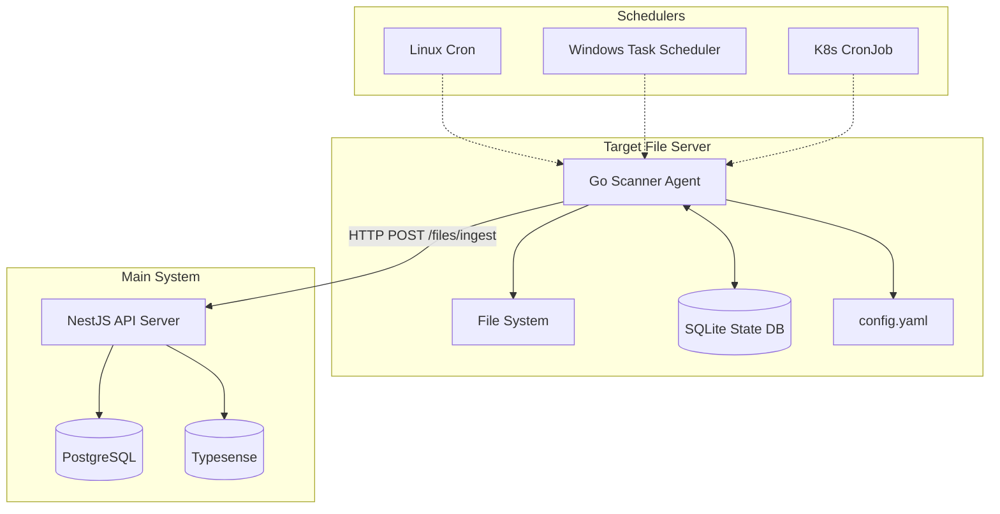

# High-Level Design: Go File Scanner Agent

## Executive Summary

This document outlines the design for a Go-based file scanning agent that will be deployed on target file servers to efficiently scan file systems and synchronize metadata with the Scientific File Tagging and Retrieval System. The agent is designed to be fast, minimal, portable, and compatible with legacy systems including Windows Server 2008.

## Table of Contents

1. [Requirements](#requirements)
2. [Architecture Overview](#architecture-overview)
3. [Design Decisions & Tradeoffs](#design-decisions--tradeoffs)
4. [Component Design](#component-design)
5. [Integration Strategy](#integration-strategy)
6. [Implementation Plan](#implementation-plan)
7. [Milestones & Tasks](#milestones--tasks)

## Requirements

### Functional Requirements

**Must Have:**

- Scan specified file system paths for file metadata
- Extract basic file information (filename, path, size, modification time, MIME type)
- Implement incremental scanning to detect file changes
- Batch HTTP requests to the main API server
- Support configuration via YAML/JSON files
- Run as scheduled task (cron, Task Scheduler, K8s CronJob)
- Maintain local state using SQLite for change detection
- Handle network failures with retry logic
- Support API key authentication

**Should Have:**

- Cross-platform compatibility (Linux, Windows, macOS)
- Configurable batch sizes and scan intervals
- Comprehensive logging and error reporting
- Graceful handling of permission errors
- Support for ignore patterns (glob-based)

**Could Have:**

- HTTP endpoint for on-demand scanning
- Real-time file system watching
- Metrics and monitoring endpoints
- Configuration hot-reloading

### Non-Functional Requirements

**Performance:**

- Handle tens of thousands of files efficiently
- Minimal memory footprint (<100MB typical usage)
- Fast startup time (<5 seconds)
- Concurrent file processing with worker pools

**Reliability:**

- Survive network outages
- Handle file system permission errors gracefully
- Maintain scan state across restarts
- Idempotent operations with the main server

**Portability:**

- Single binary deployment
- Compatible with Go 1.17+ (Windows Server 2008 constraint)
- No external runtime dependencies
- Cross-compilation support

## Architecture Overview



### Data Flow

1. **Scheduler triggers** the Go agent
2. **Agent scans** configured file system paths
3. **State comparison** with SQLite to detect changes
4. **Batch processing** of changed files
5. **HTTP requests** to main API server
6. **State update** in SQLite upon successful sync

## Design Decisions & Tradeoffs

### Technology Choices

| Decision               | Rationale                                                                                            | Tradeoffs                                                      |
| ---------------------- | ---------------------------------------------------------------------------------------------------- | -------------------------------------------------------------- |
| **Go Language**        | Fast native code, excellent concurrency, single binary deployment, Windows Server 2008 compatibility | Learning curve for team, different from existing Node.js stack |
| **SQLite for State**   | Embedded, no external dependencies, ACID transactions, excellent Go support                          | Single-threaded writes (not an issue for this use case)        |
| **HTTP REST API**      | Simple, leverages existing `/files/ingest` endpoint, stateless                                       | Less efficient than message queues, but simpler                |
| **YAML Configuration** | Human-readable, supports comments, good Go libraries                                                 | Slightly more complex parsing than JSON                        |
| **Batch Processing**   | Reduces network overhead, leverages server idempotency                                               | Potential for larger memory usage, delayed updates             |

### Architectural Tradeoffs

**Agent Responsibilities vs Server Responsibilities:**

- ✅ **Agent**: File I/O, metadata extraction, change detection, HTTP communication
- ✅ **Server**: Business logic, tagging rules, database operations, search indexing
- **Benefit**: Clean separation of concerns, agent stays minimal and fast

**Local State vs Stateless:**

- ✅ **Chose Local State (SQLite)**: Enables efficient incremental scanning
- **Alternative**: Stateless with server-side change detection
- **Benefit**: Reduced network traffic, faster scans, works offline

**Direct HTTP vs Message Queue:**

- ✅ **Chose Direct HTTP**: Simpler for MVP, leverages existing API
- **Alternative**: Message queue (Redis, RabbitMQ)
- **Benefit**: Fewer moving parts, easier deployment and debugging

## Component Design

### Project Structure (Nx Workspace)

- Database query optimization
- Concurrent processing tuning

- [ ] **Production Deployment**
  - Deploy to staging environment
  - Monitor performance and stability
  - Production deployment with rollback plan
  - Operational runbooks and monitoring setup

**Acceptance Criteria:**

- System handles production workloads without issues
- Integration with existing API is seamless
- Deployment process is automated and reliable
- Monitoring and alerting are functional

### Milestone 6: Monitoring & Maintenance

**Duration:** Ongoing  
**Deliverables:** Operational excellence and continuous improvement

**Tasks:**

- [ ] **Operational Monitoring**

  - Set up alerting for scan failures
  - Monitor API response times and error rates
  - Track file processing metrics
  - Database performance monitoring

- [ ] **Maintenance & Updates**

  - Regular security updates
  - Performance tuning based on production data
  - Feature enhancements based on user feedback
  - Documentation updates

- [ ] **Future Enhancements**
  - Real-time file watching capabilities
  - Web UI for scanner management
  - Advanced retry strategies
  - Content-based file analysis

**Acceptance Criteria:**

- System operates reliably in production
- Issues are detected and resolved quickly
- Performance meets or exceeds SLAs
- Continuous improvement process is established

## Risk Assessment & Mitigation

### Technical Risks

| Risk                                   | Impact | Probability | Mitigation                                                          |
| -------------------------------------- | ------ | ----------- | ------------------------------------------------------------------- |
| Go 1.17 compatibility issues           | High   | Low         | Extensive testing on target platforms, conservative library choices |
| SQLite performance with large datasets | Medium | Medium      | Proper indexing, connection pooling, performance testing            |
| Network reliability issues             | Medium | High        | Robust retry logic, circuit breakers, offline operation capability  |
| File system permission errors          | Low    | High        | Graceful error handling, detailed logging, skip and continue        |
| Memory usage with large file counts    | Medium | Medium      | Streaming processing, batch size limits, memory profiling           |

### Operational Risks

| Risk                           | Impact | Probability | Mitigation                                                  |
| ------------------------------ | ------ | ----------- | ----------------------------------------------------------- |
| Scheduler configuration errors | Medium | Medium      | Comprehensive documentation, validation tools               |
| API key management             | High   | Low         | Secure configuration management, key rotation procedures    |
| Deployment complexity          | Medium | Medium      | Automated deployment scripts, comprehensive documentation   |
| Monitoring gaps                | Medium | Medium      | Comprehensive logging, alerting setup, operational runbooks |

## Performance Targets

### Throughput Requirements

- **File Processing Rate**: 1,000+ files per minute
- **Memory Usage**: <100MB for typical workloads (<50K files)
- **Startup Time**: <5 seconds
- **API Response Time**: <2 seconds for batch requests

### Scalability Targets

- **File Count**: Support up to 1M files per scan path
- **Concurrent Scans**: Support multiple scan paths simultaneously
- **Batch Size**: Configurable from 10 to 1,000 files per batch
- **Worker Threads**: Configurable from 1 to 50 workers

## Security Considerations

### Authentication & Authorization

- API key authentication for server communication
- Secure storage of API keys in configuration
- Support for key rotation without service restart

### Data Protection

- No sensitive file content is transmitted
- Metadata only includes file paths and basic attributes
- Local SQLite database contains no sensitive information

### Network Security

- HTTPS-only communication with main server
- Configurable timeout and retry policies
- Certificate validation for API endpoints

## Deployment Strategies

### Linux Environments

```bash
# Cron job configuration
0 */6 * * * /usr/local/bin/scanner --config /etc/scanner/config.yaml

# Systemd service (optional)
[Unit]
Description=File Scanner Agent
After=network.target

[Service]
Type=oneshot
ExecStart=/usr/local/bin/scanner --config /etc/scanner/config.yaml
User=scanner
Group=scanner

[Install]
WantedBy=multi-user.target
```

### Windows Environments

```powershell
# Task Scheduler configuration
$action = New-ScheduledTaskAction -Execute "C:\scanner\scanner.exe" -Argument "--config C:\scanner\config.yaml"
$trigger = New-ScheduledTaskTrigger -Daily -At "06:00" -RepetitionInterval (New-TimeSpan -Hours 6)
Register-ScheduledTask -TaskName "FileScanner" -Action $action -Trigger $trigger
```

### Kubernetes Environments

```yaml
apiVersion: batch/v1
kind: CronJob
metadata:
  name: file-scanner
spec:
  schedule: '0 */6 * * *'
  jobTemplate:
    spec:
      template:
        spec:
          containers:
            - name: scanner
              image: file-scanner:latest
              command: ['/app/scanner']
              args: ['--config', '/config/config.yaml']
              volumeMounts:
                - name: config
                  mountPath: /config
                - name: scan-data
                  mountPath: /data
          restartPolicy: OnFailure
          volumes:
            - name: config
              configMap:
                name: scanner-config
            - name: scan-data
              persistentVolumeClaim:
                claimName: scan-data-pvc
```

## Configuration Reference

### Complete Configuration Example

```yaml
# config.yaml
server:
  base_url: 'https://api.example.com'
  api_key: '${SCANNER_API_KEY}' # Environment variable
  timeout: '30s'
  retry_attempts: 3
  retry_delay: '5s'

scanner:
  scan_paths:
    - '/data/documents'
    - '/data/images'
    - "\\\\server\\shared\\files" # Windows UNC path

  ignore_patterns:
    - '*.tmp'
    - '*.log'
    - '.git/*'
    - 'node_modules/*'
    - 'Thumbs.db'
    - '.DS_Store'

  batch_size: 100
  max_file_size: '100MB'
  worker_count: 10

  # File type detection
  mime_detection: true
  custom_mime_types:
    '.xyz': 'application/xyz-data'

database:
  path: './scanner_state.db'
  backup_enabled: true
  backup_interval: '24h'
  max_backups: 7

logging:
  level: 'info' # debug, info, warn, error
  format: 'json' # json, text
  file: './scanner.log'
  max_size: '10MB'
  max_backups: 5
  max_age: '7d'

# Performance tuning
performance:
  read_buffer_size: '64KB'
  concurrent_api_calls: 3
  memory_limit: '100MB'

# Health check endpoint (optional)
health:
  enabled: false
  port: 8080
  path: '/health'
```

## Monitoring & Observability

### Key Metrics

- **Scan Duration**: Time taken for complete scan cycle
- **Files Processed**: Count of files processed per scan
- **API Success Rate**: Percentage of successful API calls
- **Error Rate**: Count and types of errors encountered
- **Memory Usage**: Peak and average memory consumption
- **Database Size**: SQLite database size growth

### Log Structure

```json
{
  "timestamp": "2024-01-15T10:30:00Z",
  "level": "info",
  "component": "scanner",
  "message": "Scan completed successfully",
  "scan_id": "scan-123",
  "metrics": {
    "duration_ms": 45000,
    "files_processed": 1250,
    "files_new": 23,
    "files_updated": 45,
    "files_deleted": 2,
    "api_calls": 13,
    "api_failures": 0
  }
}
```

### Alerting Rules

- **Scan Failure**: Alert if scan fails 3 consecutive times
- **API Failure Rate**: Alert if API failure rate >10% over 1 hour
- **Memory Usage**: Alert if memory usage >150MB
- **Database Growth**: Alert if database size grows >50% in 24 hours

## Future Enhancements

### Phase 2 Features (Post-MVP)

1. **Real-time File Watching**

   - Use file system events for immediate change detection
   - Reduce scan frequency for static directories
   - Support for network file system events

2. **Advanced Content Analysis**

   - File content checksums for duplicate detection
   - Basic text extraction for searchable content
   - Image metadata extraction (EXIF data)

3. **Management Interface**

   - Web UI for scanner configuration and monitoring
   - REST API for remote management
   - Dashboard for scan statistics and health

4. **Enhanced Deployment**

   - Helm charts for Kubernetes deployment
   - Ansible playbooks for automated deployment
   - Docker Compose integration with main system

5. **Advanced Features**
   - Plugin system for custom file processors
   - Rule-based file categorization
   - Integration with cloud storage providers

## Conclusion

This High-Level Design provides a comprehensive roadmap for implementing a Go-based file scanner agent that integrates seamlessly with the existing Scientific File Tagging and Retrieval System. The design prioritizes:

- **Performance**: Native Go performance with concurrent processing
- **Reliability**: Robust error handling and state management
- **Portability**: Single binary deployment across platforms
- **Maintainability**: Clean architecture with clear separation of concerns
- **Scalability**: Designed to handle large file systems efficiently

The phased implementation approach ensures steady progress with regular deliverables, while the comprehensive task breakdown provides clear guidance for development teams. The integration with the Nx workspace using the [@nx-go/nx-go](https://github.com/nx-go/nx-go) plugin ensures consistency with existing development practices and tooling.

The solution addresses the core requirement of efficiently coupling file ingestion from scanning while maintaining the agent's focus on speed and minimalism, with all business logic remaining in the server where it belongs.
