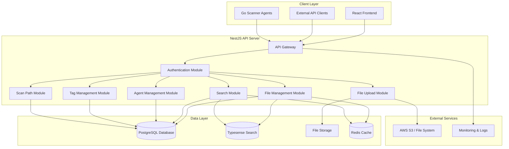

# High-Level Design: NestJS API Server

## Executive Summary

This document outlines the design for the NestJS API server that serves as the central backend for the File Search System. The server provides REST APIs for file metadata management, search capabilities, agent coordination, and user interfaces for file organization and tagging.

## Table of Contents

1. [Requirements](#requirements)
2. [Architecture Overview](#architecture-overview)
3. [Design Decisions & Tradeoffs](#design-decisions--tradeoffs)
4. [Component Design](#component-design)
5. [Database Design](#database-design)
6. [API Design](#api-design)
7. [Implementation Plan](#implementation-plan)
8. [Security Considerations](#security-considerations)
9. [Performance Targets](#performance-targets)
10. [Monitoring & Observability](#monitoring--observability)

## Requirements

### Functional Requirements

**Must Have (MVP):**

- File metadata CRUD operations with PostgreSQL storage
- Typesense integration for fuzzy search and filtering
- Agent registration and heartbeat management
- File ingestion API for scanner agents
- Tag management system with rule-based tagging
- File upload service with automatic tagging
- Scan path configuration and management
- RESTful API with OpenAPI documentation

**Should Have (MVP):**

- Basic authentication and authorization
- File deletion detection and soft deletes
- Batch file processing capabilities
- Error handling and validation
- Logging and basic monitoring
- Database migrations and schema management

**Could Have (Post-MVP):**

- Advanced search with filters and facets
- Role-based access control (RBAC)
- File content indexing and text search
- Webhook system for external integrations
- Advanced analytics and reporting
- Caching layer for improved performance

### Non-Functional Requirements

**Performance:**

- Handle 10,000+ files in database
- Support 100+ concurrent API requests
- Sub-second response times for search queries
- Efficient batch processing (1000+ files per batch)

**Scalability:**

- Horizontal scaling capability
- Database connection pooling
- Stateless service design
- Caching strategies for frequently accessed data

**Reliability:**

- 99.9% uptime target
- Graceful error handling
- Database transaction integrity
- Backup and recovery procedures

## Architecture Overview



## Design Decisions & Tradeoffs

### Key Technology Decisions

| Decision             | Rationale                                                                                  | Tradeoffs                                  |
| -------------------- | ------------------------------------------------------------------------------------------ | ------------------------------------------ |
| **NestJS Framework** | TypeScript support, decorator-based architecture, excellent ecosystem, built-in validation | Learning curve, opinionated structure      |
| **PostgreSQL**       | ACID compliance, JSON support, excellent performance, mature ecosystem                     | More complex than NoSQL for simple queries |
| **Typesense**        | Fast fuzzy search, faceted search, easy setup, good performance                            | Additional service to maintain             |
| **Redis**            | High-performance caching, session storage, pub/sub capabilities                            | Additional infrastructure complexity       |
| **Drizzle ORM**      | Type-safe queries, lightweight, good performance, migration support                        | Smaller ecosystem compared to TypeORM      |

### Data Storage Strategy

| Approach                   | Pros                          | Cons                          | Decision           |
| -------------------------- | ----------------------------- | ----------------------------- | ------------------ |
| **PostgreSQL + Typesense** | Structured data + fast search | Dual write complexity         | ✅ **Chosen**      |
| **PostgreSQL Only**        | Single source of truth, ACID  | Limited full-text search      | Alternative        |
| **Elasticsearch**          | Advanced search capabilities  | Complex setup, resource heavy | Future enhancement |

## Component Design

### Module Structure

```
apps/server/src/
├── app/
│   ├── app.module.ts              # Root application module
│   ├── app.controller.ts          # Health check endpoints
│   └── app.service.ts             # Application-level services
├── auth/
│   ├── auth.module.ts             # Authentication module
│   ├── auth.service.ts            # JWT token management
│   ├── auth.guard.ts              # Route protection
│   └── strategies/                # Passport strategies
├── file-management/
│   ├── file-management.module.ts  # File CRUD operations
│   ├── file-management.service.ts # File business logic
│   ├── file-management.controller.ts # File API endpoints
│   └── dto/                       # Data transfer objects
├── search/
│   ├── search.module.ts           # Search functionality
│   ├── search.service.ts          # Typesense integration
│   ├── search.controller.ts       # Search API endpoints
│   └── dto/                       # Search DTOs
├── agent-management/
│   ├── agent-management.module.ts # Agent coordination
│   ├── agent-management.service.ts # Agent business logic
│   ├── agent-management.controller.ts # Agent API endpoints
│   └── dto/                       # Agent DTOs
├── file-upload/
│   ├── file-upload.module.ts      # File upload handling
│   ├── file-upload.service.ts     # Upload business logic
│   ├── file-upload.controller.ts  # Upload API endpoints
│   └── dto/                       # Upload DTOs
├── tag-management/
│   ├── tag-management.module.ts   # Tag operations
│   ├── tag-management.service.ts  # Tag business logic
│   ├── tag-management.controller.ts # Tag API endpoints
│   └── dto/                       # Tag DTOs
├── scan-path/
│   ├── scan-path.module.ts        # Scan path configuration
│   ├── scan-path.service.ts       # Scan path business logic
│   ├── scan-path.controller.ts    # Scan path API endpoints
│   └── dto/                       # Scan path DTOs
├── db/
│   ├── database.provider.ts       # Database connection
│   ├── schema.ts                  # Drizzle schema definitions
│   └── migrations/                # Database migrations
├── common/
│   ├── filters/                   # Exception filters
│   ├── interceptors/              # Request/response interceptors
│   ├── decorators/                # Custom decorators
│   └── utils/                     # Utility functions
└── config/
    ├── database.config.ts         # Database configuration
    ├── typesense.config.ts        # Typesense configuration
    └── app.config.ts              # Application configuration
```

## Database Design

### Core Tables

```sql
-- Files table (main entity)
CREATE TABLE files (
    id UUID PRIMARY KEY DEFAULT gen_random_uuid(),
    filename TEXT NOT NULL,
    path TEXT NOT NULL UNIQUE,
    file_type TEXT NOT NULL,
    file_size BIGINT NOT NULL,
    created_at TIMESTAMP WITH TIME ZONE NOT NULL,
    updated_at TIMESTAMP WITH TIME ZONE NOT NULL,
    deleted_at TIMESTAMP WITH TIME ZONE,
    last_indexed_at TIMESTAMP WITH TIME ZONE NOT NULL,
    metadata JSONB DEFAULT '{}'::jsonb,
    checksum VARCHAR(64), -- SHA-256 hash

    -- Indexes
    CONSTRAINT files_path_unique UNIQUE (path),
    INDEX idx_files_filename (filename),
    INDEX idx_files_file_type (file_type),
    INDEX idx_files_updated_at (updated_at),
    INDEX idx_files_deleted_at (deleted_at),
    INDEX idx_files_last_indexed_at (last_indexed_at)
);

-- Tags table (many-to-many with files)
CREATE TABLE tags (
    id UUID PRIMARY KEY DEFAULT gen_random_uuid(),
    file_id UUID NOT NULL REFERENCES files(id) ON DELETE CASCADE,
    name TEXT NOT NULL,
    source TEXT NOT NULL DEFAULT 'manual', -- 'manual', 'rule', 'agent'
    created_at TIMESTAMP WITH TIME ZONE NOT NULL DEFAULT NOW(),

    -- Indexes
    INDEX idx_tags_file_id (file_id),
    INDEX idx_tags_name (name),
    INDEX idx_tags_source (source),
    UNIQUE (file_id, name)
);

-- Scan paths table
CREATE TABLE scan_paths (
    id UUID PRIMARY KEY DEFAULT gen_random_uuid(),
    path_glob TEXT NOT NULL,
    agent_id UUID REFERENCES agents(id),
    created_at TIMESTAMP WITH TIME ZONE NOT NULL DEFAULT NOW(),
    updated_at TIMESTAMP WITH TIME ZONE NOT NULL DEFAULT NOW(),
    last_scanned_at TIMESTAMP WITH TIME ZONE,
    next_scan_at TIMESTAMP WITH TIME ZONE,
    last_status TEXT DEFAULT 'pending',
    last_error_message TEXT,
    failure_count INTEGER DEFAULT 0,
    scan_interval INTERVAL NOT NULL DEFAULT '1 hour',
    priority SMALLINT DEFAULT 1,
    enabled BOOLEAN DEFAULT true,

    -- Indexes
    INDEX idx_scan_paths_agent_id (agent_id),
    INDEX idx_scan_paths_next_scan_at (next_scan_at),
    INDEX idx_scan_paths_last_status (last_status),
    INDEX idx_scan_paths_enabled (enabled)
);

-- Scan path ignores table
CREATE TABLE scan_path_ignores (
    id UUID PRIMARY KEY DEFAULT gen_random_uuid(),
    scan_path_id UUID NOT NULL REFERENCES scan_paths(id) ON DELETE CASCADE,
    pattern TEXT NOT NULL,
    created_at TIMESTAMP WITH TIME ZONE NOT NULL DEFAULT NOW(),

    -- Indexes
    INDEX idx_scan_path_ignores_scan_path_id (scan_path_id)
);

-- Agents table
CREATE TABLE agents (
    id UUID PRIMARY KEY DEFAULT gen_random_uuid(),
    agent_id TEXT NOT NULL UNIQUE,
    hostname TEXT NOT NULL,
    version TEXT NOT NULL,
    status TEXT NOT NULL DEFAULT 'active',
    last_heartbeat TIMESTAMP WITH TIME ZONE,
    capabilities JSONB DEFAULT '[]'::jsonb,
    metadata JSONB DEFAULT '{}'::jsonb,
    created_at TIMESTAMP WITH TIME ZONE NOT NULL DEFAULT NOW(),
    updated_at TIMESTAMP WITH TIME ZONE NOT NULL DEFAULT NOW(),

    -- Indexes
    INDEX idx_agents_agent_id (agent_id),
    INDEX idx_agents_status (status),
    INDEX idx_agents_last_heartbeat (last_heartbeat)
);

-- Tag rules table (for automated tagging)
CREATE TABLE tag_rules (
    id UUID PRIMARY KEY DEFAULT gen_random_uuid(),
    name TEXT NOT NULL,
    description TEXT,
    conditions JSONB NOT NULL, -- Rule conditions
    actions JSONB NOT NULL,    -- Actions to take
    priority INTEGER DEFAULT 1,
    enabled BOOLEAN DEFAULT true,
    created_at TIMESTAMP WITH TIME ZONE NOT NULL DEFAULT NOW(),
    updated_at TIMESTAMP WITH TIME ZONE NOT NULL DEFAULT NOW(),

    -- Indexes
    INDEX idx_tag_rules_enabled (enabled),
    INDEX idx_tag_rules_priority (priority)
);
```

### Typesense Schema

```typescript
// Typesense collection schema
export const filesCollectionSchema = {
  name: 'files',
  fields: [
    { name: 'id', type: 'string' },
    { name: 'filename', type: 'string' },
    { name: 'path', type: 'string' },
    { name: 'directory', type: 'string' },
    { name: 'file_type', type: 'string', facet: true },
    { name: 'file_size', type: 'int64' },
    { name: 'tags', type: 'string[]', facet: true },
    { name: 'created_at', type: 'int64' },
    { name: 'updated_at', type: 'int64' },
    { name: 'last_indexed_at', type: 'int64' },
  ],
  default_sorting_field: 'updated_at',
};
```

## API Design

### Core API Endpoints

#### File Management API

```typescript
// File CRUD operations
GET    /api/files              # List files with pagination
GET    /api/files/:id          # Get file details
PUT    /api/files/:id          # Update file metadata
DELETE /api/files/:id          # Soft delete file
POST   /api/files/bulk-update  # Bulk update files
POST   /api/files/ingest       # Ingest files from agents

// File ingestion (for agents)
POST   /api/files/ingest
{
  files: [{
    filename: string,
    path: string,
    file_type: string,
    file_size: number,
    created_at: string,
    updated_at: string,
    last_indexed_at: string,
    tags?: string[],
    metadata?: object
  }]
}
```

#### Search API

```typescript
// Search endpoints
GET    /api/search             # Search files
GET    /api/search/facets      # Get search facets
POST   /api/search/advanced    # Advanced search with filters

// Search request/response
POST   /api/search
{
  query?: string,
  filters?: {
    file_type?: string[],
    tags?: string[],
    date_range?: {
      start: string,
      end: string
    }
  },
  sort?: string,
  page?: number,
  limit?: number
}
```

#### Agent Management API

```typescript
// Agent coordination
POST   /api/agents/register    # Register new agent
POST   /api/agents/:id/heartbeat # Agent heartbeat
GET    /api/agents             # List agents
GET    /api/agents/:id         # Get agent details
PUT    /api/agents/:id         # Update agent
DELETE /api/agents/:id         # Deregister agent

// Agent registration
POST   /api/agents/register
{
  agent_id: string,
  hostname: string,
  version: string,
  capabilities?: string[],
  metadata?: object
}
```

#### Tag Management API

```typescript
// Tag operations
GET    /api/tags               # List all tags
GET    /api/tags/popular       # Get popular tags
POST   /api/tags               # Create tag
PUT    /api/tags/:id           # Update tag
DELETE /api/tags/:id           # Delete tag
POST   /api/tags/bulk-apply    # Bulk apply tags
```

#### File Upload API

```typescript
// File upload
POST   /api/upload             # Upload file with metadata
POST   /api/upload/bulk        # Bulk file upload
GET    /api/upload/presigned   # Get presigned URL for direct upload
```

#### Scan Path Management API

```typescript
// Scan path configuration
GET    /api/scan-paths         # List scan paths
POST   /api/scan-paths         # Create scan path
PUT    /api/scan-paths/:id     # Update scan path
DELETE /api/scan-paths/:id     # Delete scan path
POST   /api/scan-paths/:id/trigger # Trigger manual scan
```

## Implementation Plan

### Phase 1: Core Infrastructure (Weeks 1-2)

**Deliverables:**

- Basic NestJS project structure
- Database schema and migrations
- Core modules setup
- Basic authentication

**Tasks:**

- [ ] Set up NestJS project with TypeScript
- [ ] Configure Drizzle ORM with PostgreSQL
- [ ] Create database schema and migrations
- [ ] Implement basic authentication module
- [ ] Set up environment configuration
- [ ] Create basic health check endpoints

### Phase 2: File Management (Weeks 3-4)

**Deliverables:**

- File CRUD operations
- Typesense integration
- Basic search functionality

**Tasks:**

- [ ] Implement file management service
- [ ] Create file CRUD endpoints
- [ ] Integrate Typesense for search
- [ ] Implement basic search endpoints
- [ ] Add file validation and error handling
- [ ] Create comprehensive tests

### Phase 3: Agent Integration (Weeks 5-6)

**Deliverables:**

- Agent management system
- File ingestion API
- Scan path configuration

**Tasks:**

- [ ] Implement agent registration and heartbeat
- [ ] Create file ingestion endpoints
- [ ] Implement scan path management
- [ ] Add agent authentication
- [ ] Create agent monitoring capabilities
- [ ] Implement batch processing

### Phase 4: Advanced Features (Weeks 7-8)

**Deliverables:**

- Tag management system
- File upload functionality
- Advanced search features

**Tasks:**

- [ ] Implement tag management system
- [ ] Create file upload endpoints
- [ ] Add advanced search filters
- [ ] Implement tag rules engine
- [ ] Add bulk operations
- [ ] Create comprehensive API documentation

## Security Considerations

### Data Protection

- **Authentication**: API key authentication via environment variables only
- **Authorization**: Role-based access control
- **Data Protection**: Encryption at rest and in transit
- **Data Retention**: 30 days for files, 30 days for tags, 30 days for scan paths
- **Data Deletion**: Soft delete with recovery capability
- **Data Backup**: Weekly full backup to S3
- **Data Recovery**: Weekly full backup to S3, incremental backups to S3
- **Input Validation**: Comprehensive validation using class-validator
- **SQL Injection Prevention**: Parameterized queries via Drizzle ORM
- **XSS Prevention**: Input sanitization and output encoding
- **CSRF Protection**: CSRF tokens for state-changing operations
- **Rate Limiting**: API rate limiting to prevent abuse

## Performance Targets

### Response Time Targets

- **File Search**: <500ms for typical queries
- **File CRUD**: <200ms for single operations
- **Batch Operations**: <5s for 1000 files
- **Agent Heartbeat**: <100ms
- **File Upload**: <2s for files up to 100MB

### Throughput Targets

- **Concurrent Requests**: 100+ simultaneous requests
- **File Ingestion**: 1000+ files per minute
- **Search Queries**: 50+ queries per second
- **Database Operations**: 500+ operations per second

### Resource Utilization

- **Memory Usage**: <512MB under normal load
- **CPU Usage**: <50% average, <80% peak
- **Database Connections**: Pool of 10-20 connections
- **Response Cache**: 80%+ cache hit rate for search

## Monitoring & Observability

### Application Metrics

- **Request Metrics**: Response times, throughput, error rates
- **Business Metrics**: File count, search queries, agent activity
- **System Metrics**: CPU, memory, disk usage, database connections
- **Custom Metrics**: File processing rates, tag application success rates

### Health Checks

- **Application Health**: `/health` endpoint with dependency checks
- **Database Health**: Connection pool status and query performance
- **Typesense Health**: Search service availability and response times
- **Agent Health**: Active agent count and last heartbeat timestamps

### Logging Strategy

- **Structured Logging**: JSON format with consistent field naming
- **Log Levels**: ERROR, WARN, INFO, DEBUG with appropriate filtering
- **Request Logging**: HTTP requests with correlation IDs
- **Business Event Logging**: File operations, search queries, agent events
- **Error Logging**: Stack traces with context and correlation data

### Alerting

- **Critical Alerts**: Service down, database unavailable, high error rates
- **Warning Alerts**: High response times, low disk space, agent disconnections
- **Business Alerts**: File processing failures, search service degradation
- **Escalation**: PagerDuty integration for critical issues

### Observability Tools

- **APM**: New Relic or DataDog for application performance monitoring
- **Metrics**: Prometheus with Grafana dashboards
- **Logging**: ELK Stack (Elasticsearch, Logstash, Kibana) or similar
- **Tracing**: Distributed tracing with OpenTelemetry

### Key Performance Indicators (KPIs)

- **Availability**: 99.9% uptime target
- **Performance**: 95th percentile response times under targets
- **Error Rate**: <1% error rate for all endpoints
- **Agent Connectivity**: >95% agent uptime
- **Search Success Rate**: >99% successful search queries

## Conclusion

This High-Level Design provides a comprehensive blueprint for implementing a production-ready NestJS API server that serves as the central backend for the File Search System. The design emphasizes:

**Key Strengths:**

- **Modular Architecture**: Clean separation of concerns with dedicated modules
- **Type Safety**: Full TypeScript support with compile-time validation
- **Scalability**: Horizontal scaling capability with stateless design
- **Performance**: Optimized database queries and caching strategies
- **Security**: Comprehensive authentication and authorization
- **Observability**: Detailed monitoring and logging capabilities

**Integration Points:**

- **Frontend**: RESTful APIs with OpenAPI documentation
- **Scanner Agents**: Dedicated endpoints for file ingestion and agent management
- **Search Engine**: Seamless Typesense integration for fast search
- **Database**: Robust PostgreSQL integration with transaction support

**Future Extensibility:**

- **Microservices**: Modular design ready for service decomposition
- **Advanced Features**: Plugin system for custom processors
- **Enterprise Features**: RBAC, audit logging, and compliance reporting
- **Cloud Integration**: Ready for cloud deployment and scaling

The implementation plan provides a clear roadmap for development teams, with well-defined milestones and deliverables that ensure steady progress toward a production-ready system.
