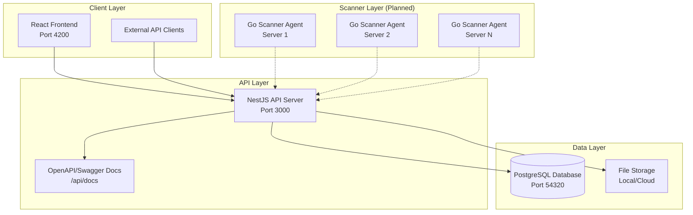

# File Search System

A comprehensive, distributed file management and search system designed to organize and provide efficient access to large collections of files across multiple servers and storage locations.

## 🎯 Background

A scientific team has accumulated a large collection of data files (e.g., CSV, PDFs, Word documents, and images) over the years. These files are dispersed across various folders and servers and lack a consistent organization scheme. The lack of semantic structure and duplication in naming and storage has led to inefficiencies in accessing relevant data for analysis or reference.

Currently, file access is done through a remote Windows Explorer interface, making it cumbersome and inefficient to search and locate needed information.

The proposed solution is a web-based application that will automatically scan file directories, assign semantic tags to files using rule-based methods (e.g., folder structure, naming conventions), and register them in a central database. This system will also support querying, editing, and uploading files in an organized manner based on metadata tags, improving accessibility and workflow efficiency. Future versions may include AI-based enhancements for more intelligent tagging and content understanding.

## 🏗️ Architecture

### Current Implementation

The system is built using a modern microservices architecture with the following components:

#### **Backend API Server** (✅ Implemented)

- **Technology**: NestJS with Fastify
- **Database**: PostgreSQL with Drizzle ORM
- **Features**:
  - RESTful API with OpenAPI/Swagger documentation
  - File metadata ingestion and management
  - Tag-based organization system
  - Batch file processing capabilities
  - Comprehensive test coverage

#### **Frontend Web Application** (✅ Implemented)

- **Technology**: React 19 with React Router 7
- **Styling**: Tailwind CSS
- **Features**:
  - Modern, responsive web interface
  - File search and filtering capabilities
  - Tag management system
  - File upload functionality

#### **Database Layer** (✅ Implemented)

- **Primary Database**: PostgreSQL for file metadata and system configuration
- **Schema**: Comprehensive data model supporting files, tags, scan paths, and system configuration
- **Migrations**: Automated database schema management with Drizzle Kit

#### **Go Scanner Agents** (🚧 Planned)

- **Technology**: Go (for performance and cross-platform compatibility)
- **Purpose**: Distributed file system scanning and metadata extraction
- **Features**:
  - Incremental scanning with change detection
  - Cross-platform support (Windows, Linux, macOS)
  - Configurable scan paths and ignore patterns
  - Batch API communication with retry logic

### System Architecture Diagram



## 🚀 Quick Start

### Prerequisites

- **Node.js** 18 or higher
- **pnpm** package manager
- **PostgreSQL** 16 or higher
- **Docker** (for local development database)

### Local Development Setup

1. **Clone and Install Dependencies**

   ```bash
   git clone <repository-url>
   cd file-search
   pnpm install
   ```

2. **Start Database**

   ```bash
   # Start PostgreSQL using Docker
   docker-compose -f docker-compose/docker-compose-postgres.yaml up -d
   ```

3. **Run Database Migrations**

   ```bash
   pnpm nx run server:migrate
   ```

4. **Start Development Servers**

   ```bash
   # Terminal 1: Start backend API server
   pnpm nx serve server

   # Terminal 2: Start frontend application
   pnpm nx dev client
   ```

5. **Access the Application**
   - **Frontend**: http://localhost:4200
   - **API Server**: http://localhost:3000/api
   - **API Documentation**: http://localhost:3000/api/docs

## 📋 Current Features

### ✅ Implemented Features

#### Backend API

- **File Ingestion**: Bulk file metadata ingestion via REST API
- **File Management**: CRUD operations for file records
- **Tag System**: Flexible tagging system for file organization
- **Database Schema**: Comprehensive data model with migrations
- **API Documentation**: Interactive Swagger/OpenAPI documentation
- **Validation**: Request/response validation with Zod schemas
- **Testing**: Comprehensive unit and integration tests

#### Frontend Application

- **Modern UI**: React 19 with Tailwind CSS styling
- **Routing**: React Router 7 for navigation
- **Responsive Design**: Mobile-friendly interface
- **Development Ready**: Hot reload and development tools

#### Database

- **PostgreSQL Schema**: Tables for files, tags, scan paths, and configuration
- **Relationships**: Proper foreign key relationships and constraints
- **Migrations**: Version-controlled database schema changes
- **Indexing**: Optimized queries with proper indexing

### 🚧 Planned Features

#### Go Scanner Agents

- **Cross-Platform Scanning**: Windows, Linux, macOS compatibility
- **Incremental Scanning**: Change detection based on file modification time and size
- **Configurable Paths**: YAML-based configuration for scan paths and ignore patterns
- **Batch Processing**: Efficient batch API communication
- **Retry Logic**: Robust error handling and retry mechanisms

#### Enhanced Search

- **Full-Text Search**: Integration with Typesense for advanced search capabilities
- **Fuzzy Matching**: Intelligent search with typo tolerance
- **Advanced Filters**: Date ranges, file types, size filters
- **Search Analytics**: Usage tracking and search optimization

#### Advanced Features

- **Real-Time Updates**: WebSocket integration for live updates
- **File Preview**: In-browser file preview capabilities
- **Bulk Operations**: Mass file operations and tag management
- **User Management**: Authentication and authorization system

## 🛠️ Development

### Project Structure

```
file-search/
├── apps/
│   ├── client/           # React frontend application
│   │   ├── app/         # Application components and routes
│   │   ├── public/      # Static assets
│   │   └── tests/       # Frontend tests
│   ├── server/          # NestJS backend API
│   │   ├── src/         # Source code
│   │   │   ├── app/     # Application modules
│   │   │   ├── db/      # Database configuration and schema
│   │   │   └── common/  # Shared utilities
│   │   └── migrations/  # Database migrations
│   └── server-e2e/      # End-to-end tests
├── docs/                # Technical documentation
├── docker-compose/      # Docker configurations
└── tools/              # Development tools and scripts
```

### Available Commands

```bash
# Development
pnpm nx serve server          # Start backend API server
pnpm nx dev client           # Start frontend development server

# Database
pnpm nx run server:migrate   # Run database migrations
pnpm nx run server:generate-migrations  # Generate new migrations

# Testing
pnpm nx test server          # Run backend tests
pnpm nx test client          # Run frontend tests
pnpm nx e2e server-e2e       # Run end-to-end tests

# Documentation
pnpm docs:dev               # Start documentation server
pnpm docs:build             # Build documentation
```

### API Endpoints

#### File Management

- `POST /api/files/ingest` - Bulk file metadata ingestion
- `GET /api/files` - Retrieve all files with metadata and tags
- `GET /api/docs` - Interactive API documentation

#### Database Schema

- **files**: File metadata and system information
- **tags**: Tag associations for file organization
- **scan_paths**: Configuration for scanner agents
- **scan_path_ignores**: Ignore patterns for scanning

## 📖 Documentation

Comprehensive technical documentation is available:

- **[Quick Start Guide](docs/quick-start.md)** - Getting started with development
- **[NestJS Server Design](docs/HLD-NestJS-Server.md)** - Backend architecture and implementation
- **[Go Scanner Agent Design](docs/HLD-Go-File-Scanner.md)** - Planned scanner agent architecture
- **[API Documentation](http://localhost:3000/api/docs)** - Interactive API documentation (when running)

## 🔧 Technology Stack

### Backend

- **Framework**: NestJS with Fastify
- **Database**: PostgreSQL 16+ with Drizzle ORM
- **Validation**: Zod schemas with nestjs-zod
- **Documentation**: OpenAPI/Swagger
- **Testing**: Vitest with comprehensive test coverage

### Frontend

- **Framework**: React 19 with React Router 7
- **Styling**: Tailwind CSS
- **Build Tool**: Vite
- **Testing**: Vitest with Testing Library

### Development Tools

- **Monorepo**: Nx workspace for project management
- **Package Manager**: pnpm
- **Linting**: ESLint with TypeScript support
- **Formatting**: Prettier
- **Database**: Drizzle Kit for migrations

## 🎯 Roadmap

### Phase 1: Core System (✅ Complete)

- [x] NestJS API server with file ingestion
- [x] PostgreSQL database with comprehensive schema
- [x] React frontend with basic UI
- [x] API documentation and testing

### Phase 2: Scanner Implementation (🚧 In Progress)

- [ ] Go-based scanner agent development
- [ ] Cross-platform compatibility testing
- [ ] Agent registration and management
- [ ] Incremental scanning capabilities

### Phase 3: Enhanced Features (📋 Planned)

- [ ] Typesense integration for advanced search
- [ ] Real-time updates with WebSocket
- [ ] File preview capabilities
- [ ] User authentication and authorization

### Phase 4: Production Deployment (📋 Planned)

- [ ] Docker containerization
- [ ] Kubernetes deployment configurations
- [ ] Monitoring and observability
- [ ] Performance optimization

## 🤝 Contributing

This project uses Nx for monorepo management and follows established patterns for both frontend and backend development. Please refer to the technical documentation for detailed implementation guidelines.

## 📄 License

MIT License - see LICENSE file for details.
