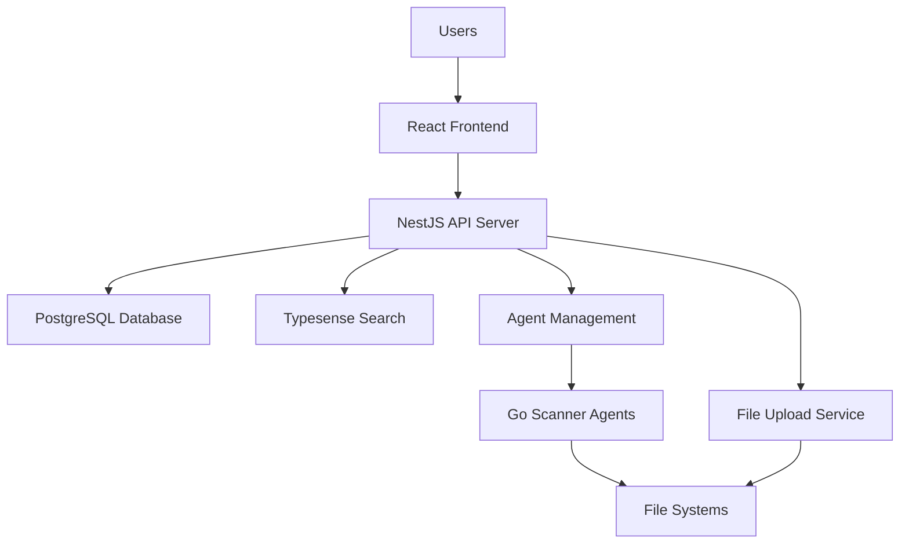

# Quick Start Guide

## System Overview

The File Search System is a comprehensive file management solution consisting of:

- **NestJS API Server**: Backend API for file metadata management, search, and agent coordination
- **React Frontend**: Web interface for searching, tagging, and managing files
- **PostgreSQL Database**: Centralized storage for file metadata, tags, and scan configurations
- **Typesense Search Engine**: Fast fuzzy search and filtering capabilities
- **Go Scanner Agents**: Lightweight agents deployed on file servers for distributed scanning

## Architecture Diagram



## Prerequisites

- Node.js 18 or higher
- pnpm package manager
- PostgreSQL database
- Typesense search engine
- Go 1.17 or higher (for agent deployment)

## Local Development Setup

### 1. Clone and Install Dependencies

```bash
git clone <repository-url>
cd file-search
pnpm install
```

### 2. Database Setup

Start PostgreSQL using Docker:

```bash
docker-compose -f docker-compose/docker-compose-postgres.yaml up -d
```

### 3. Environment Configuration

Create environment files:

```bash
# Copy environment templates
cp apps/server/.env.example apps/server/.env
cp apps/client/.env.example apps/client/.env
```

Configure the following in `apps/server/.env`:

- Database connection string
- Typesense API key and endpoint
- File upload paths
- Agent authentication keys

### 4. Database Migration

Run database migrations:

```bash
pnpm nx run server:migrate
```

### 5. Start Development Servers

Start the backend server:

```bash
pnpm nx serve server
```

Start the frontend client:

```bash
pnpm nx serve client
```

## Production Deployment

### Core System Deployment

1. **Deploy Database**: Set up PostgreSQL with proper backups and monitoring
2. **Deploy Search Engine**: Configure Typesense with appropriate schemas
3. **Deploy API Server**: Build and deploy the NestJS application
4. **Deploy Frontend**: Build and serve the React application

### Agent Deployment

For detailed agent deployment instructions, see the [Go File Scanner Agent Documentation](./HLD-Go-File-Scanner.md).

#### Building the Go Agent

```bash
# Navigate to the scanner app directory (when implemented)
cd apps/scanner
go build -o file-scanner ./cmd/main.go
```

#### Agent Configuration

Create a `config.yaml` file for each agent:

```yaml
server:
  url: 'https://your-api-server.com'
  api_key: 'your-agent-api-key'

agent:
  id: 'unique-agent-identifier'
  hostname: 'file-server-01'

scan_paths:
  - '/data/documents'
  - '/shared/projects'

ignore_patterns:
  - '*.tmp'
  - '.git/**'
  - 'node_modules/**'

batch_size: 100
scan_interval: '1h'
```

#### Running the Agent

```bash
./file-scanner --config config.yaml
```

## System Components

### 1. Web Interface Features

- File search with fuzzy matching
- Tag-based filtering and organization
- Manual tag editing and bulk operations
- File upload with automatic tagging
- Admin interface for scan path management

### 2. API Server Capabilities

- RESTful API for file operations
- Agent registration and management
- Scan path configuration
- Tag management and rules
- File ingestion pipeline

### 3. Scanner Agent Features

- Incremental file scanning
- Metadata extraction (size, type, timestamps)
- Change detection and synchronization
- Configurable scan intervals
- Retry logic and error handling

## Next Steps

1. **Explore the System**: Use the web interface to search and manage files
2. **Configure Scan Paths**: Set up directories to be monitored
3. **Deploy Agents**: Install scanner agents on target file servers
4. **Agent Details**: For advanced agent configuration, see [Go File Scanner Agent HLD](./HLD-Go-File-Scanner.md)

## API Documentation

Once the server is running, access the interactive API documentation at:

- **Swagger UI**: `http://localhost:3000/api/docs`
- **API Endpoints**: `http://localhost:3000/api/`

## Troubleshooting

### Common Issues

1. **Database Connection**: Ensure PostgreSQL is running and credentials are correct
2. **Missing Dependencies**: Run `pnpm install` to install all packages
3. **Port Conflicts**: Check that ports 3000 (API) and 4200 (Frontend) are available
4. **Agent Connection**: Verify API keys and network connectivity from agent to server

### Getting Help

- Review [agent-specific documentation](./HLD-Go-File-Scanner.md)
- Examine server logs for detailed error messages
